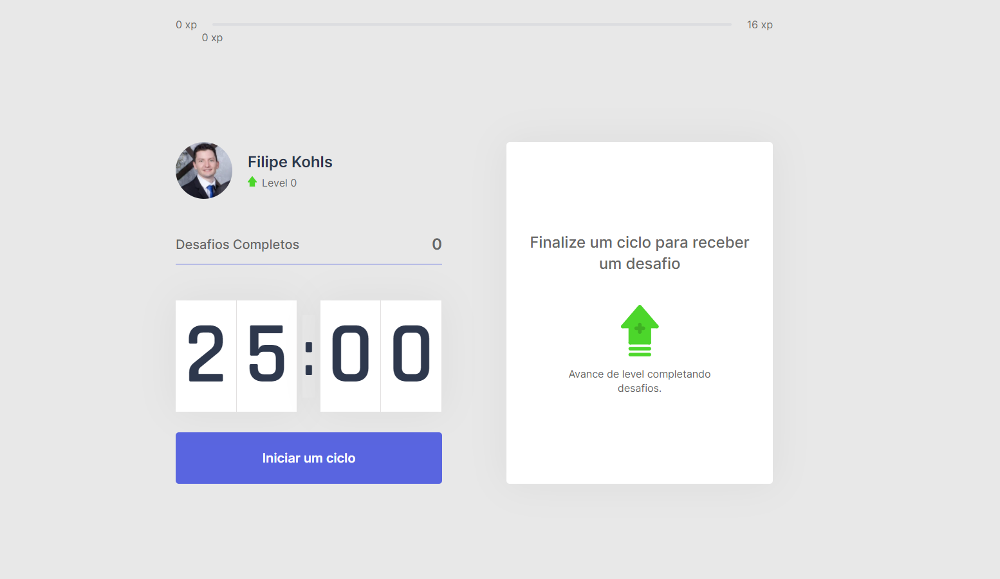

# Pomodoro project

Projeto desenvolvido durante a Next Level Week #4, da Rocketseat ministrada pelo Diego Fernandes, o qual tem o objetivo de criar um pomodoro baseado em ciclos de 25 minutos.
Quando cada ciclo é concluído, é fornecido um desafio para o usuário realizar (executar um determinado exercício), para estimular o usuário a não ficar muito sentado em frente ao computador sem se movimentar.

Os exercícios são aleatórios e cada um fornece uma detemrinada experiência, que quando concluído acumula-se à experiência do usuário fazendo-o passar de nível.

Tecnologias utilizadas:
 - ReactJS
 - NextJS
 - Typescript
 - ContextAPI 
 - Styled-Components

